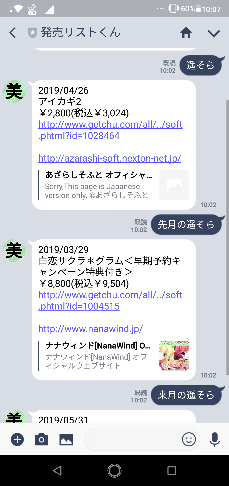
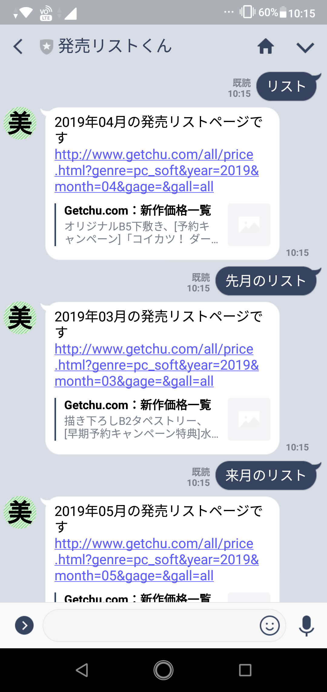
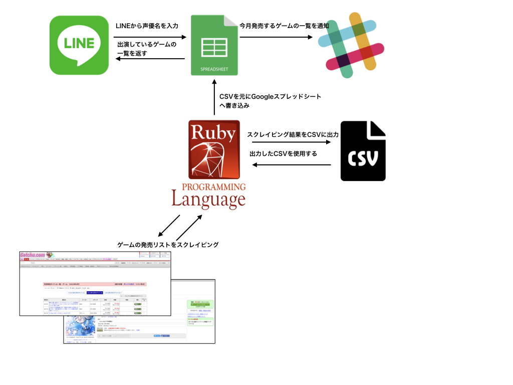
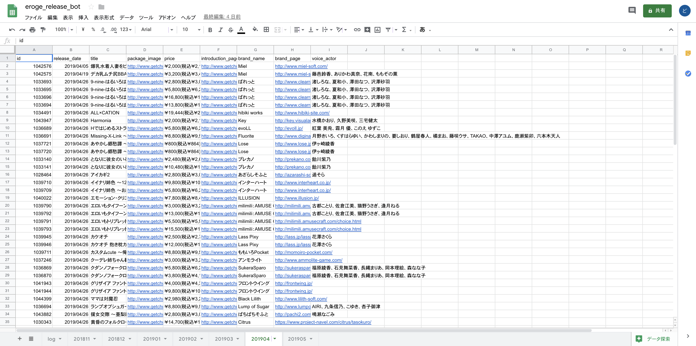

# 発売リストくん 

## なんのソフト？

声優名で話しかけるとその声優が出演するゲームを教えてくれるLINE BOTです。

## 使い方

友だち追加ボタンをクリックするかQRコードから友達追加をして下さい。  

| <a href="https://line.me/R/ti/p/%40kox6824y"></a> |  |
|:---:|:---:|

声優名で話しかけるとその声優が出演するゲームを教えてくれます。  



話しかけ方は３パターンあります。  

- `声優名`
- `先月の声優名`
- `来月の声優名`

声優名以外にも「リスト」と話しかけるとゲームの発売リストページを教えてくれます。



話しかけ方は声優名と同じで３パターンあります。  

- `リスト`
- `先月のリスト`
- `来月のリスト`

サンプル画像は2019年4月に実行したものになります。

## 仕組み



[eroge_release_cmd](https://github.com/dodonki1223/eroge_release_cmd)を使用し、[げっちゅ屋](http://www.getchu.com/top.html?gc=gc)の[発売日リスト](http://www.getchu.com/all/price.html?genre=pc_soft&year=2019&month=3&gage=&gall=all)ページをスクレイピングした結果をGoogleスプレッドシートに書き込み、LINE BOTからの入力をGoogleスプレッドシートで受け取り、受け取った内容を元にGoogleスプレッドシート内を検索し、見つかった内容をLINE BOTに返す。



## 導入方法

### Messaging APIの設定

LINEのエンジニアの方が書かれている記事を參考にMessaging APIの作成を行って下さい。
- [LINEのBot開発 超入門（前編） ゼロから応答ができるまで - Qiita](https://qiita.com/nkjm/items/38808bbc97d6927837cd)  

LINEのアクセストークンが必要なのでメモしておいて下さい。  
`BOT`の作成は必要ないので作成しなくて大丈夫です。`BOT`はGoogleスプレッドシートで作成します。

### BOTの作成

新規にGoogleスプレッドシートを作成。  
[eroge_release_cmd](https://github.com/dodonki1223/eroge_release_cmd)でGoogleスプレッドシートに書き込みができるように設定。  
  
Googleスプレッドシートからスクリプトエディタを開きます。  


スクリプトエディタが開いたらBOT用の設定ファイル（config.gs）を作成し、下記の内容を記述して下さい


```javascript
// LineAccessToken  ：LINE developersのメッセージ送受信設定に記載のアクセストークン
// LinePostUrl      ：LINE Messaging APIのURL
// SlackWebHookUrl  ：SlackにPostするURL
// SlackPostChannel ：Slackに投稿するチャンネルID
// SlackPostUserIcon：Slackに投稿するユーザーのアイコンURL
var config = {
  LineAccessToken  : 'Line Access Token',
  LinePostUrl      : 'https://api.line.me/v2/bot/message/reply',
  SlackWebHookUrl  : 'Slack Web Hook URL',
  SlackPostChannel : 'Slack Channel',
  SlackPostUserIcon: 'Icon URL'
};
```

- LineAccessToken
- SlackWebHookUrl
    - Slack通知を使用する人は記述して下さい
- SlackPostChannel
    - Slack通知を使用する人は記述して下さい
- SlackPostUserIcon
    - Slack通知を使用する人は記述して下さい

このリポジトリの内容をスクリプトエディタに反映して下さい。下記ファイルを作成すること。  

- post.gs
- yearMonth.gs
- sheet.gs
- message.gs
- slack.gs
- debug.gs(無くても問題ないです)

### Slack通知


Googleスプレッドシートに書き込んだ内容をSlackに通知させることができます。  
スクリプトエディタからトリガーを設定することで今月発売するリストの内容をSlackに通知させることができます。

  

トリガー設定画面


## API制限について

下記のURLを参照すること

### LINE API制限について

- [Messaging APIリファレンス](https://developers.line.biz/ja/reference/messaging-api/)

### GoogleスプレッドシートAPIについて

- [Google Apps Script ドキュメント](https://developers.google.com/apps-script/guides/services/quotas)