# eroge_release_gas

スクレイピングした美少女ゲーム情報が書き込まれたGoogleスプレッドシートツールです

## 概要

主に以下の２つの機能を持ちます

- 声優名で話しかけると出演するゲームを教えてくれる `LINE BOT` （発売リストくん）
- 美少女ゲームの情報を格納するデータベースの情報に整形しS3にアップロードする機能

## 発売リストくん

声優名で話しかけると出演するゲームを教えてくれる `LINE BOT` です


### 仕組み

大まかな仕組みを説明します

#### 処理の流れ

1. [eroge_release_cmd](https://github.com/dodonki1223/eroge_release_cmd)を使用し、[げっちゅ屋](http://www.getchu.com/top.html?gc=gc)の[発売日リスト](http://www.getchu.com/all/price.html?genre=pc_soft&year=2019&month=3&gage=&gall=all)ページをスクレイピングしスクレイピング結果をCSV出力する
2. 出力されたCSV結果をGoogleスプレッドシートに書き込み
3. 発売リストくん（LINE BOT）に声優名を入力
4. Googleスプレッドシートから声優の出演情報を元にゲームの情報を検索
5. ゲームの情報を発売リストくん（LINE BOT）に返す

#### その他

Googleスプレッドシートには以下のような感じで書き込まれています  
データの検索、発売リストくん（LINE BOT）への結果通知は `Google Apps Script` で書かれています


### 登録方法

`友だち追加` ボタンをクリックするか `QRコード` から友達追加をして下さい

| <a href="https://line.me/R/ti/p/%40kox6824y"></a> |  |
|:-------------------------------------------------------------------------------------------------------------------------------------------------------------:|:---------------------------------------------------------------------------------------------------------------------------------------:|

### 使用方法

登録した `発売リストくん（LINE BOT）` に `声優名` もしくは `リスト` と話しかけるだけです  
`声優名` と `リスト` それぞれ話しかけ方は３パターンあります

- 声優名 or リスト
- 先月の 声優名 or リスト
- 来月の 声優名 or リスト

|  |  |
|:-------------------------------------------------------------------------------------------------------------------------------------------------------------:|:---------------------------------------------------------------------------------------------------------------------------------------------------------------:|

サンプル画像は2019年4月に実行したものになります。

### Slack通知

Slackに発売のリスト情報を定期で通知させます


### 環境構築


## 導入方法

### Messaging APIの設定

LINEのエンジニアの方が書かれている記事を參考にMessaging APIの作成を行って下さい。
- [LINEのBot開発 超入門（前編） ゼロから応答ができるまで - Qiita](https://qiita.com/nkjm/items/38808bbc97d6927837cd)  

LINEのアクセストークンが必要なのでメモしておいて下さい。  
`BOT`の作成は必要ないので作成しなくて大丈夫です。`BOT`はGoogleスプレッドシートで作成します。

### BOTの作成

新規にGoogleスプレッドシートを作成。  
[eroge_release_cmd](https://github.com/dodonki1223/eroge_release_cmd)でGoogleスプレッドシートに書き込みができるように設定。  
  
Googleスプレッドシートからスクリプトエディタを開きます。  

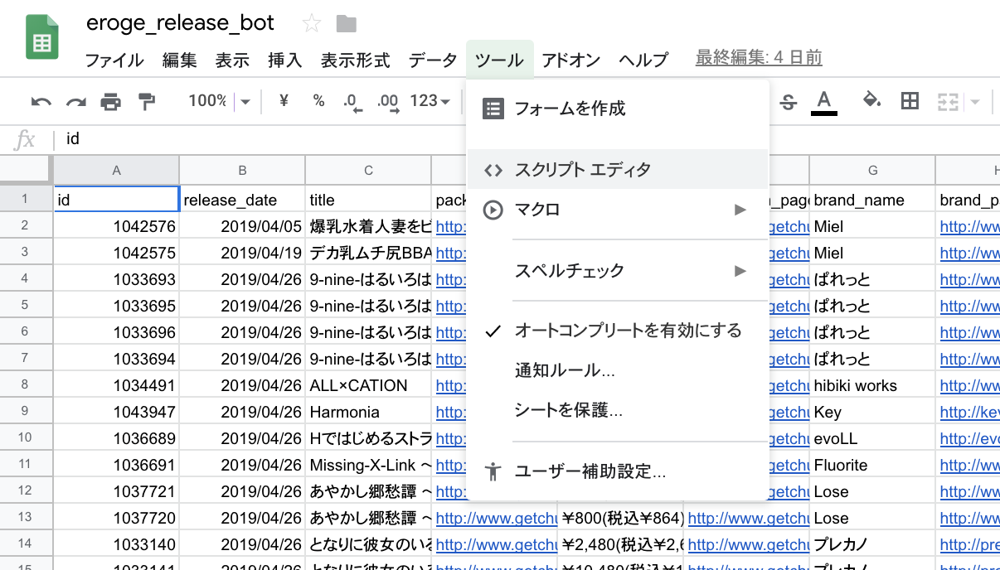

スクリプトエディタが開いたらBOT用の設定ファイル（config.gs）を作成し、下記の内容を記述して下さい  
`_config.gs` を `config.gs` にリネームしてください

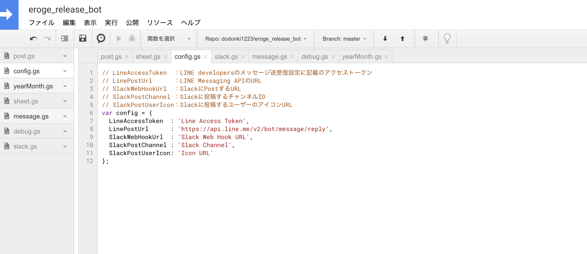

```javascript
// LineAccessToken  ：LINE developersのメッセージ送受信設定に記載のアクセストークン
// LinePostUrl      ：LINE Messaging APIのURL
// SlackWebHookUrl  ：SlackにPostするURL
var config = {
  LineAccessToken  : 'Line Access Token',
  LinePostUrl      : 'https://api.line.me/v2/bot/message/reply',
  SlackWebHookUrl  : 'Slack Web Hook URL'
};
```

- LineAccessToken
- SlackWebHookUrl
    - Slack通知を使用する人は記述して下さい

このリポジトリの内容をスクリプトエディタに反映して下さい。下記ファイルを作成すること。  

- post.gs
- yearMonth.gs
- sheet.gs
- message.gs
- slack.gs
- debug.gs(無くても問題ないです)

### Slack通知

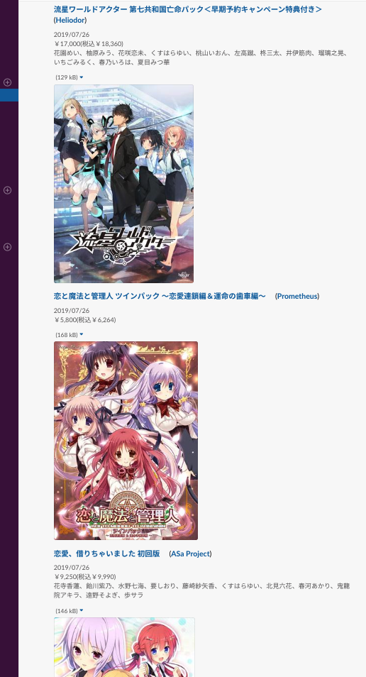

Googleスプレッドシートに書き込んだ内容をSlackに通知させることができます。  
スクリプトエディタからトリガーを設定することで今月発売するリストの内容をSlackに通知させることができます。

#### 通知ようのアプリをSlackに追加する

まずは通知させるための[Slack App](https://api.slack.com/apps)を作成します。  
[Slack App](https://api.slack.com/apps)リンクをクリックしてページに遷移して下さい。

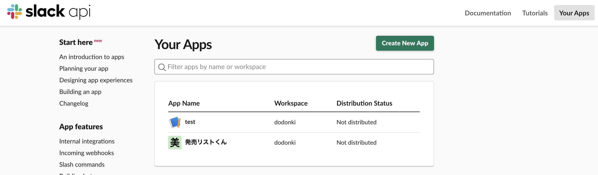

`Create New App`をクリックします。  

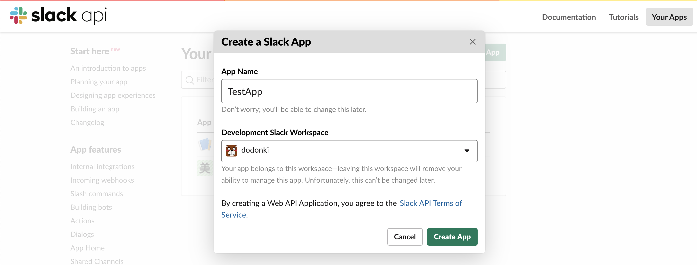

`App Name`,`Development Slack Warkspace`を記述して`Create App`をクリックします。

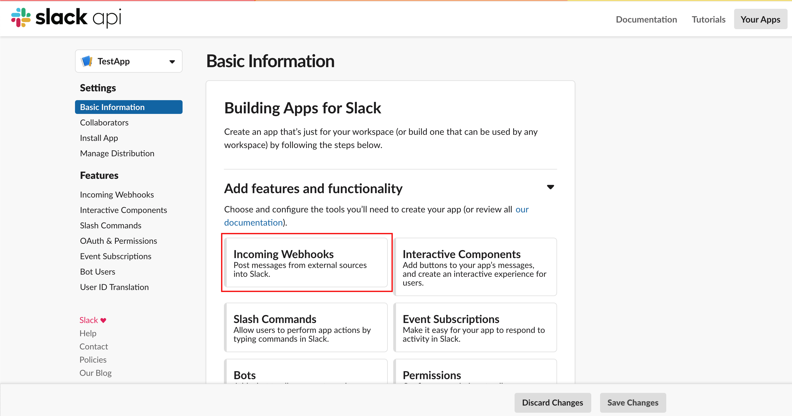

`Incoming Webhooks`をクリックします。  

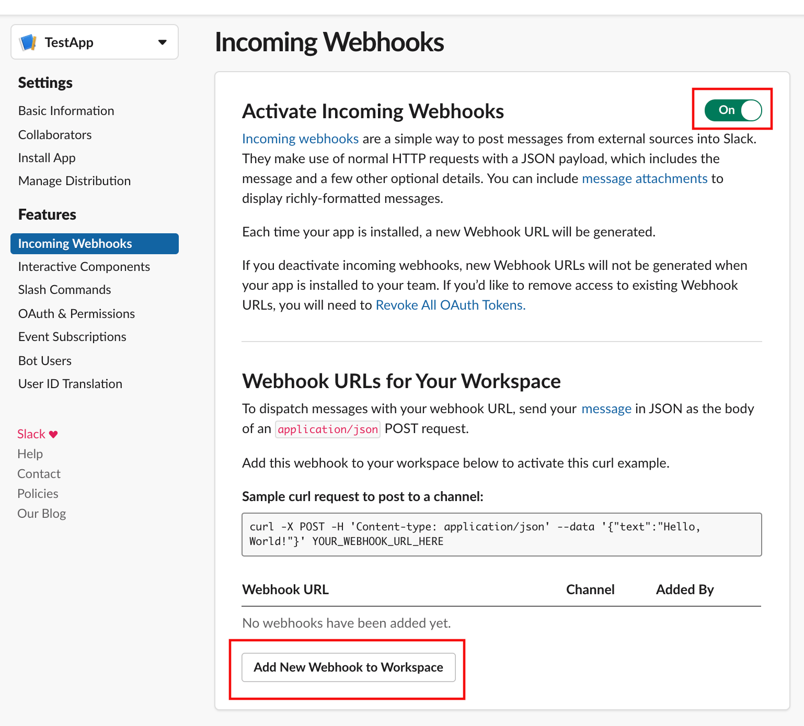

`Off→On`に変更し、`Add New Webhook to Workspace`をクリックします。

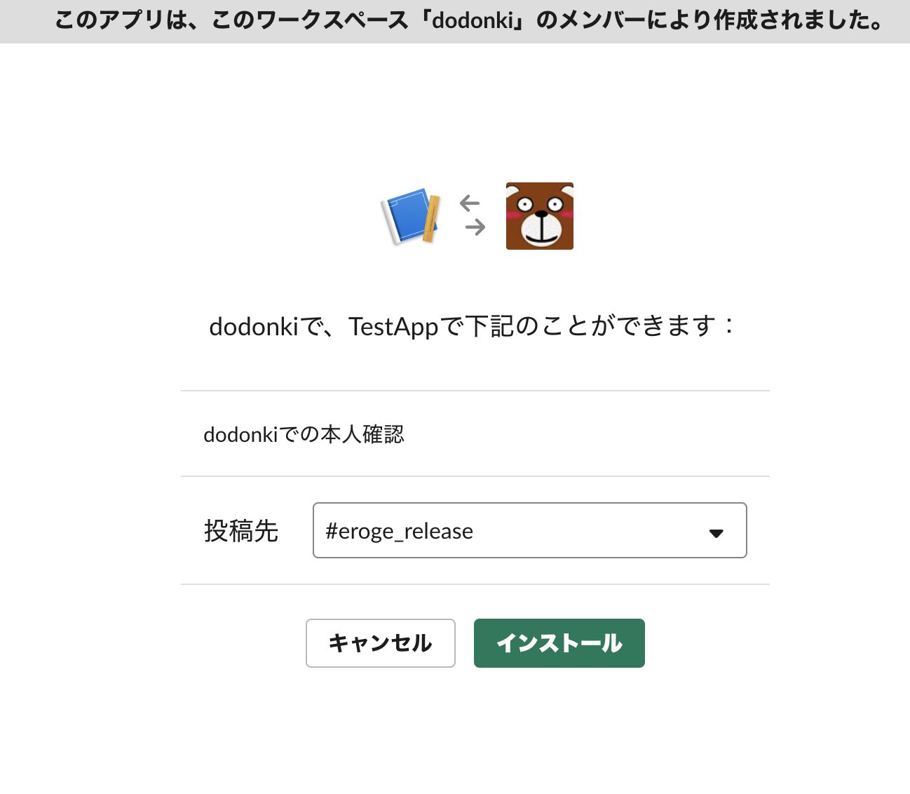

`投稿先`を設定してインストールします。

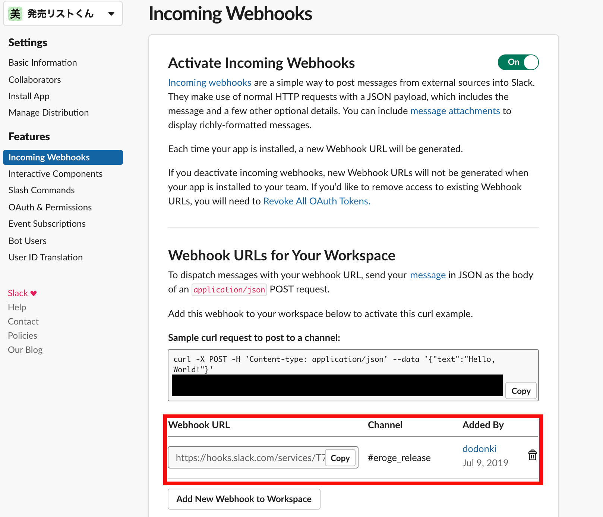

`copy`をクリックすることでWebhook用のURLをコピーできます。  
コピーしたURLを`config.gs`の`SlackWebHookUrl`に設定してください。  

#### Slackに定期通知させるためトリガーを設定する

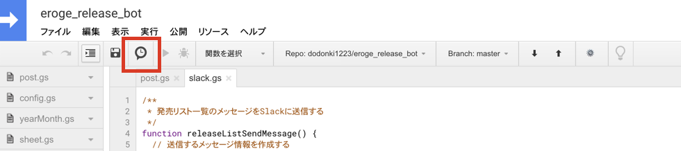  

トリガー設定画面

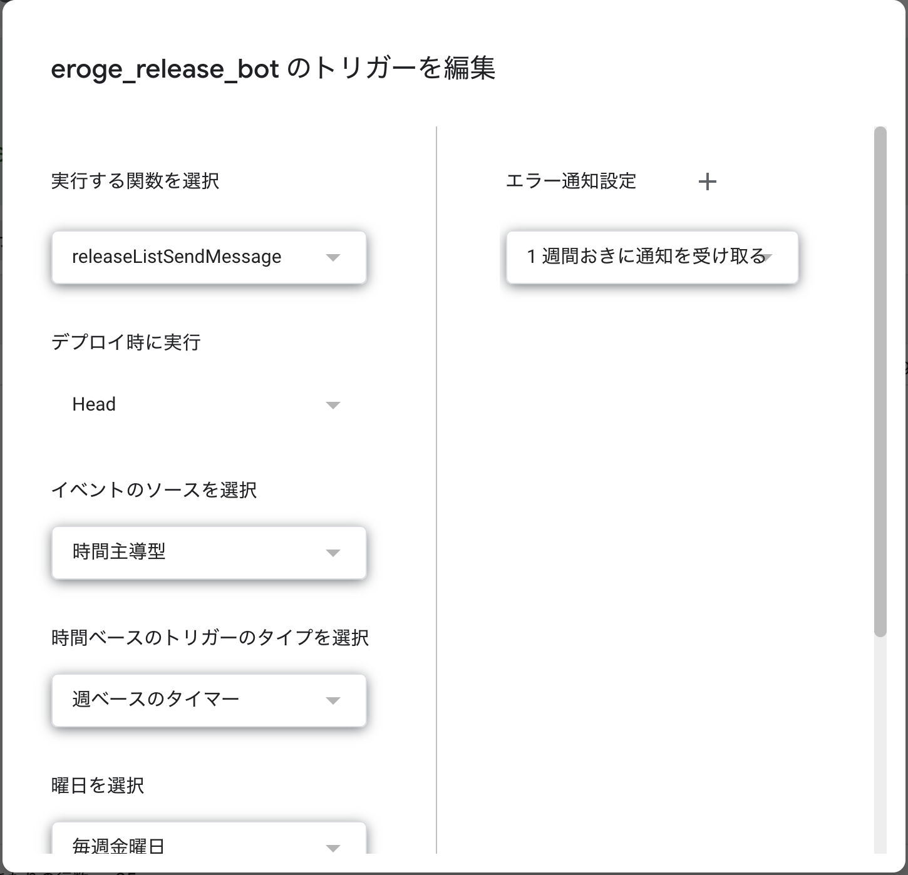

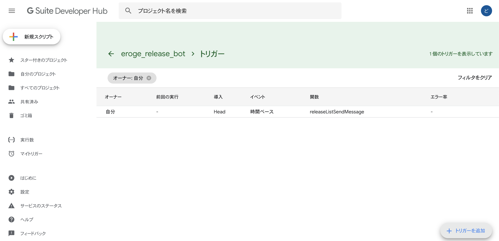

## API制限について

下記のURLを参照すること

### LINE API制限について

- [Messaging APIリファレンス](https://developers.line.biz/ja/reference/messaging-api/)

### GoogleスプレッドシートAPIについて

- [Google Apps Script ドキュメント](https://developers.google.com/apps-script/guides/services/quotas)
